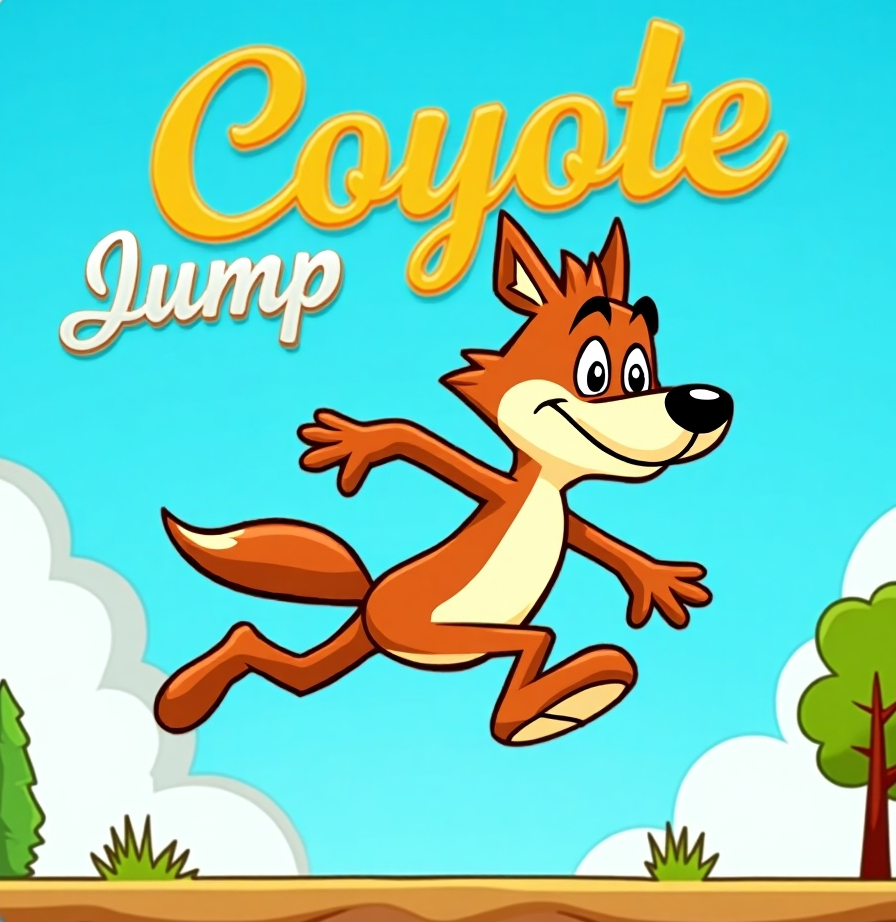

<p align="center">
  
</p>

In Godot, go to **Project > Project Settings > Plugins** and enable the plugin called `CoyoteJump`.

---

## 🚀 Usage

1. Add a `CoyoteJump` node as a child of your player character (`CharacterBody2D`, for example).
2. Call `set_on_floor()` in `_physics_process()` to inform the plugin whether the character is on the ground.
3. Use `consume_jump()` to perform a buffered or coyote-time jump.

### 🎮 Example (Player Script)

```gdscript
@onready var jump_handler = $CoyoteJump

func _physics_process(delta):
 jump_handler.set_on_floor(is_on_floor())

 if jump_handler.consume_jump():
     velocity.y = -jump_force
```

## 🙌 Créditos

Desarrollado por [Mariano Damian Abadie].  
Inspirado por mecánicas clásicas de juegos de plataformas como _Celeste_, _Hollow Knight_ y _Super Meat Boy_.

---

## ❤️ Apoya este proyecto

Si este plugin te ha sido útil y deseas apoyar su desarrollo, puedes hacer una donación:

👉 [Donar aquí](https://whydonate.com/es/donate/donaciones-por-proyectos)

Tu apoyo ayuda a mantener herramientas como esta libres y actualizadas. ¡Gracias!
